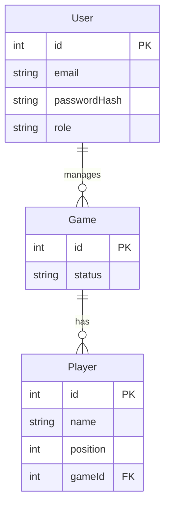

# Data Model

```mermaid
erDiagram
  Game ||--o{ Player : has
  User ||--o{ Game : manages
  Game {
    int id PK
    string status
  }
  Player {
    int id PK
    string name
    int position
    int gameId FK
  }
  User {
    int id PK
    string email
    string passwordHash
    string role
  }
```
